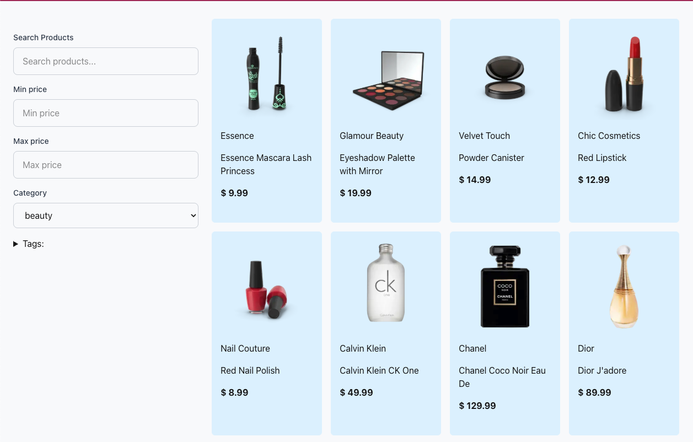

# Ecommerce Product Filter

A modern, responsive ecommerce product filtering application built with Next.js, TypeScript, and Tailwind CSS. Features advanced filtering capabilities with real-time search, price range filtering, category selection, and tag-based filtering.

## 🌟 Features

- **Advanced Product Filtering**: Search by title, filter by price range, category, and tags
- **Real-time Search**: Instant filtering as you type
- **Responsive Design**: Works seamlessly on desktop, tablet, and mobile devices
- **Smooth Animations**: Beautiful stagger animations using Framer Motion
- **TypeScript**: Fully typed for better development experience
- **Clean Architecture**: Follows SOLID principles with separated business and presentation logic

## 🚀 Live Demo

**Visit the live website:** [https://ecommercefilter-8de80xcry-maxstoutens-projects.vercel.app/](https://ecommercefilter-8de80xcry-maxstoutens-projects.vercel.app/)

## 🛠️ Tech Stack

- **Framework**: Next.js 15 (App Router)
- **Language**: TypeScript
- **Styling**: Tailwind CSS
- **Animations**: Framer Motion
- **State Management**: React Hooks
- **Architecture**: Custom hooks for business logic separation

## 🏗️ Project Structure

```
my-app/
├── app/
│   ├── components/
│   │   ├── ui/          
│   │   ├── ProductCard.tsx
│   │   ├── ProductCards.tsx
│   │   └── Sidebar.tsx
│   ├── hooks/          
│   │   └── useProductFilters.ts
│   ├── layout.tsx
│   └── page.tsx
├── public/
│   └── products.json  
└── README.md
```

## 🚀 Getting Started

First, run the development server:

```bash
npm run dev
# or
yarn dev
# or
pnpm dev
# or
bun dev
```

Open [http://localhost:3000](http://localhost:3000) with your browser to see the result.

## 🎯 Key Features Explained

### Product Filtering
- **Search**: Filter products by title in real-time
- **Price Range**: Set minimum and maximum price filters
- **Category**: Filter by product categories
- **Tags**: Multi-select tag filtering with checkboxes

### Responsive Design
- Mobile-first approach
- Adaptive grid layout
- Collapsible sidebar on mobile devices

### Performance Optimizations
- Memoized filtering logic
- Efficient state management
- Optimized re-renders

## 📱 Screenshots



## 🔧 Customization

The application is built with extensibility in mind:
- Easy to add new filter types
- Modular component architecture
- Reusable UI components
- Type-safe interfaces

---

Built with ❤️ using Next.js and TypeScript
